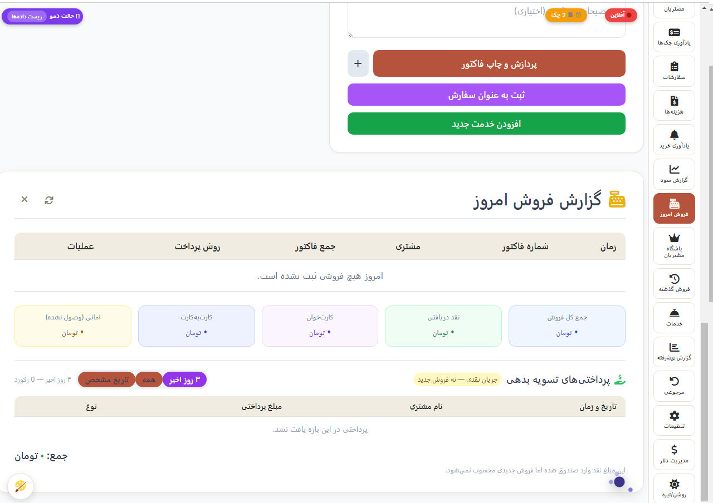
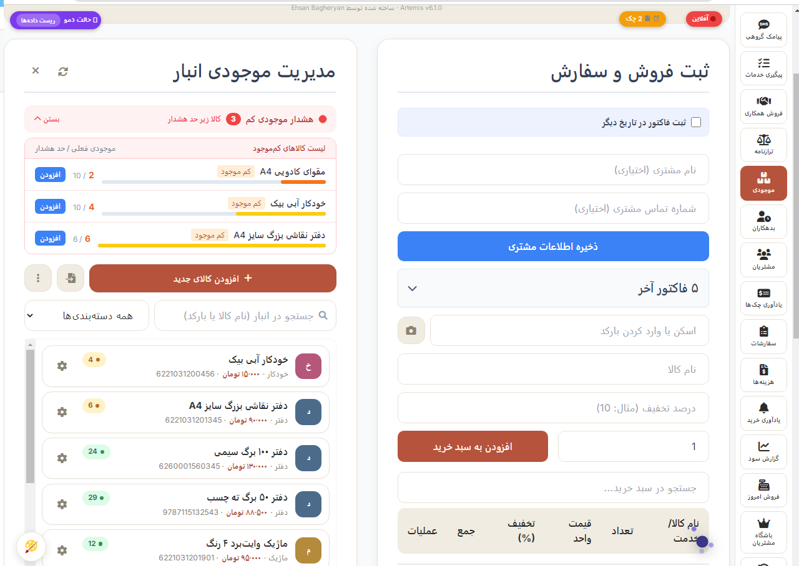
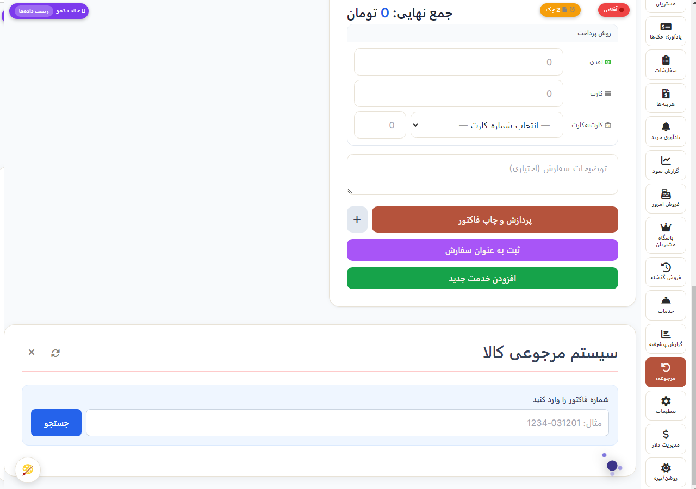
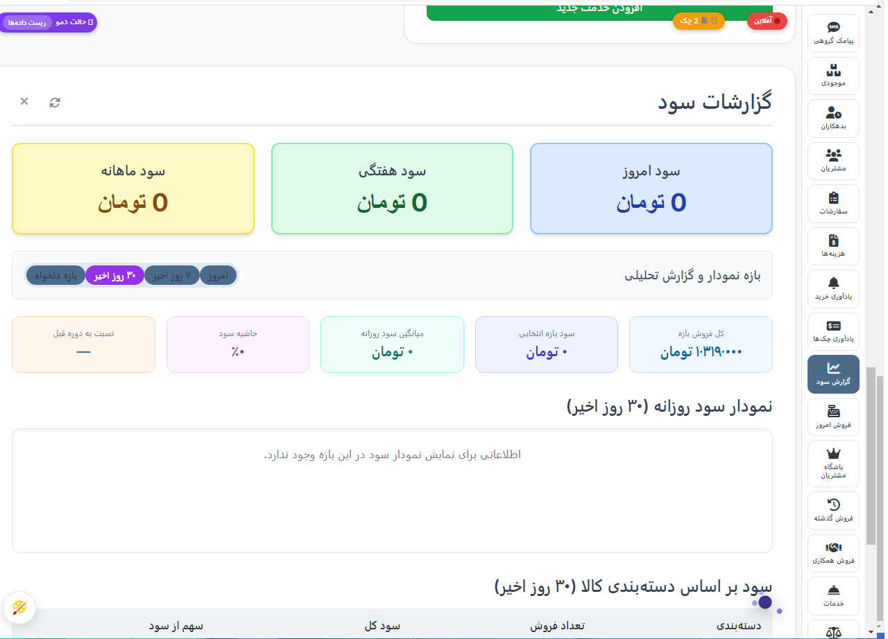
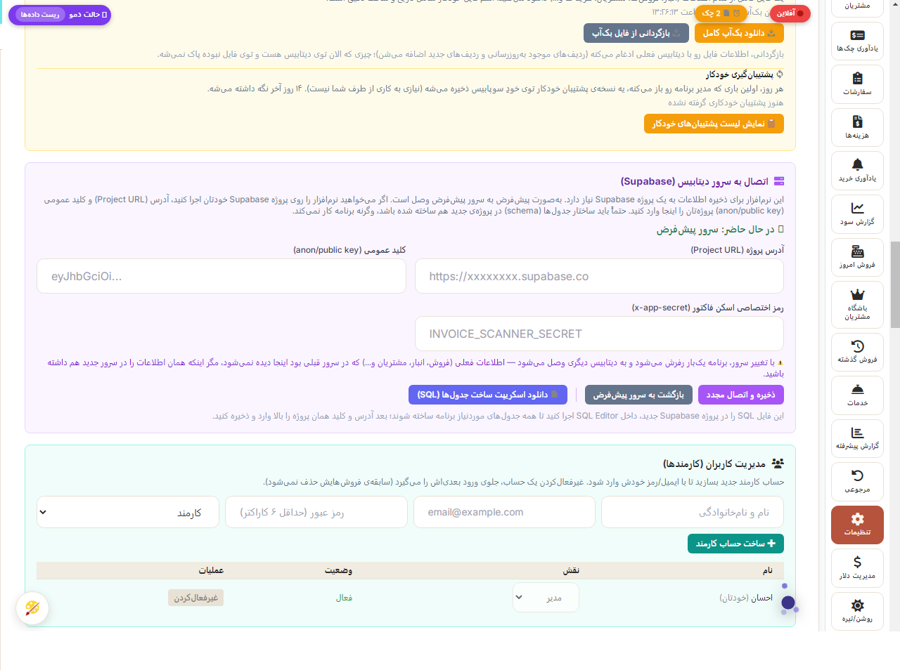

# آرتمیس — سیستم مدیریت فروشگاه و صندوق فروش (POS)

🌐 **[English](README.md) | [فارسی](README.fa.md) | [Deutsch](README.de.md) | [العربية](README.ar.md)**

**یه اپ کامل مدیریت کسب‌وکار و صندوق فروش (POS) برای کسب‌وکارهای کوچیک و مغازه‌ها، با دستیار هوش مصنوعی متصل به دیتابیس و پیش‌بینی فروش.**

`JavaScript` · `HTML/CSS` · `Supabase` · `PostgreSQL` · `Capacitor` · `Gemini API`


**در یک نگاه:**
- یه POS/ERP کامل فروشگاهی (فروش، موجودی، مرجوعی، حسابداری، چاپ) — به‌علاوه‌ی یه دستیار هوش مصنوعی متصل به دیتابیس و پیش‌بینی فروش heuristic، نه فقط یه CRUD ساده.
- خوداتکا روی پروژه‌ی Supabase خودت (Postgres + Auth + Realtime + Edge Functions)؛ هم به‌صورت اپ وب، هم اپ بومی اندروید (با Capacitor) عرضه می‌شه.
- طی دو سال استفاده‌ی واقعی و روزانه توی یه مغازه‌ی واقعی ساخته و تکمیل شده — نه یه پروژه‌ی آموزشی.

---

## معرفی

**آرتمیس** از یه نیاز ساده شروع شد: فرار از هزینه‌ی نرم‌افزارهای صندوق فروشِ گرون‌قیمتِ بازار و دردسر نصب‌شون برای یه مغازه‌ی واقعی، و طی دو سال استفاده‌ی روزانه، ویژگی به ویژگی تبدیل شد به یه پلتفرم کامل مدیریت کسب‌وکار: فروش، موجودی، مشتریان، کارمندان، حسابداری، چاپ، و یه دستیار هوش مصنوعی که واقعاً از داده‌های مغازه خبر داره.

هم به‌صورت یه اپ وب (از هر مرورگری) و هم به‌صورت اپ اندروید بومی (با Capacitor) کار می‌کنه، و هر دو با پروژه‌ی خوداتکای [Supabase](https://supabase.com) خودت حرف می‌زنن — یعنی هر نصب کاملاً مالک اطلاعات خودشه.

> **وضعیت پروژه:** پروژه‌ی شخصی فعال، در حال استفاده‌ی واقعی و روزانه. این ریپو نسخه‌ی دموی عمومی/پورتفولیوعه — بخش «توجه درباره‌ی ریپوی عمومی» رو ببین.

## چرا آرتمیس؟

این پروژه دور نیازهای واقعی عملیاتی ساخته شده، نه به‌عنوان یه تمرین آکادمیک CRUD. ویژگی‌ها دقیقاً وقتی اضافه شدن که یه نیاز مشخص و عملی پیش اومده:

```text
مشکل واقعی کسب‌وکار ← طراحی یه فرایند ← پیاده‌سازیش ← تست با فروش
واقعی ← پیدا کردن حالت‌های خاص ← بهبود پایداری ← یکپارچه‌سازی با
بقیه‌ی سیستم
```

مثال‌های مشخص از همین کد: تعویض کالا که فقط مابه‌التفاوت قیمت رو تسویه می‌کنه به‌جای دو تراکنش کامل، یه صف فروش آفلاین که موقع قطعی اتصال وسط یه فروش نمی‌ذاره فاکتور تکراری ساخته بشه، یه لایه‌ی چندسرویس‌دهنده برای پیامک/چاپ به‌جای قفل‌شدن روی یه فروشنده‌ی خاص، و یه پیش‌بینی فروش که خودش رو از تاریخچه‌ی واقعی روزهای مناسبتی تنظیم می‌کنه، نه یه ضریب ثابت دستی.

---

## امکانات اصلی

**فروش و صندوق** — ثبت فروش با اسکن بارکد، تخفیف، پرداخت نقدی/کارت/کارت‌به‌کارت/نسیه، فروش عمده (همکاری)، و یه ماژول جدای هزینه‌یابی برای کارهای خدماتی (مثل چاپ/کپی) با تفکیک هزینه به اجزا.

**مدیریت موجودی** — ردیابی موجودی با هشدار کمبود کالا، دسته‌بندی، کاردکس (تاریخچه‌ی ورود/خروج) هر کالا، و ساخت/چاپ برچسب بارکد برای کالاهایی که از قبل بارکد ندارن.

**مرجوعی و تعویض** — مرجوعی کامل/جزئی با اصلاح خودکار موجودی و سود؛ تعویض کالا که فقط مابه‌التفاوت قیمت رو تسویه می‌کنه، کاملاً ردیابی‌شده به‌جای یه راه‌حل دستی.

**مدیریت مشتریان** — پروفایل، تاریخچه‌ی خرید، ردیابی بدهی، و پیامک گروهی به بدهکاران/همه‌ی مشتریان/شماره‌های دلخواه از طریق یه لایه‌ی قابل‌تعویض (کاوه‌نگار، ملی‌پیامک، اس‌ام‌اس.آی‌آر، یا هر API دیگه‌ای از طریق Webhook عمومی).

**باشگاه وفاداری** — امتیاز بر اساس خرید با نرخ کسب/استفاده‌ی قابل‌تنظیم و سطح‌بندی مشتری (عادی / پرخرید / VIP) بر اساس میزان خرید.

**حسابداری و گزارشات** — ترازنامه، چند حساب نقدی/بانکی، ردیابی هزینه‌ها، سند افتتاحیه، گزارش روزانه/سود، و یادآوری خرید/پرداخت چک.

**چاپ** — چاپ A4/A5/A6 و پرینتر حرارتی فیش‌زن (۵۸/۸۰ میلی‌متر)، چاپ مستقیم بلوتوث از اپ اندروید، محتوای فاکتور کاملاً قابل‌تنظیم، و مبلغ به حروف.

**مولتی‌یوزر** — نقش مدیر/کارمند با ورود جداگانه و ردیابی عملیات هر کارمند.

**چندزبانه** — فارسی، انگلیسی، آلمانی، عربی، با پشتیبانی کامل راست‌به‌چپ و چند واحد پول.

**وب + اندروید** — اپ وب تک‌فایل (بدون مرحله‌ی build) به‌علاوه‌ی اپ اندروید بسته‌بندی‌شده با Capacitor، با اسکن بارکد از دوربین، ورود با اثر انگشت، و اعلان‌های محلی.

---

## دستیار هوشمند کسب‌وکار

یکی از ویژگی‌های اصلی آرتمیس، یه دستیار چت هست که دور داده‌های واقعی مغازه ساخته شده، نه یه چت‌بات عمومی که فقط چسبونده شده باشه.

### دو پرسونا

- **آرتمیس** — دستیاری رسمی‌تر برای سؤالات مالی و کسب‌وکاری.
- **آریا** — پرسونایی سبک‌تر و محاوره‌ای برای سؤالات روزمره‌ی سریع.

هرکدوم پالت رنگ، سبک خوش‌آمدگویی، و لحن خودشون رو دارن؛ سوییچ بین‌شون از همون ویجت چت آنیه.

### یه معماری سه‌لایه‌ی ترکیبی

۱. **موتور نیت محلی (Local Intent Engine)** — سلام/تشکر و الگوهای رایج دیگه مستقیم از منطق داخل اپ تشخیص داده و پاسخ داده می‌شن، بدون رفت‌وبرگشت به سرور.
۲. **کوئری مستقیم دیتابیس** — سؤالات کسب‌وکاری («امروز چقدر فروختیم»، «مشتریای برتر کیا هستن»، «کدوم کالاها کم موجودی دارن») مستقیم از سمت کلاینت با کوئری روی Supabase/PostgreSQL پاسخ داده می‌شن.
۳. **پردازش هوش مصنوعی/سمت سرور (Gemini)** — هر چیز بازتر و پیچیده‌تر به یه Edge Function در Supabase (به اسم `gemini-handler`) ارجاع داده می‌شه، طوری که فراخوانی‌های AI و هر رمز مرتبط باهاشون کاملاً از دسترس کلاینت دوره.

### پیش‌بینی فروش

دستیار می‌تونه هفته یا ماه پیش‌رو رو از روی تاریخچه‌ی واقعی فروش پیش‌بینی کنه، با یه مدل قانون‌محور (heuristic) — نه یه مدل یادگیری ماشین آموزش‌دیده:

- یه **خط‌پایه‌ی هر روز هفته** از تاریخچه‌ی فروش می‌سازه.
- یه **ضریب واقعی مناسبت** برای رویدادهای تکرارشونده (مثلاً یه تعطیلی خاص) رو با مقایسه‌ی فروش واقعیِ گذشته‌ی همون مناسبت با خط‌پایه یاد می‌گیره، با وزن‌دهی‌ای که مناسبت‌های اخیر رو بیشتر از قدیمی‌ترها حساب می‌کنه — و وقتی داده‌ی کافی نیست، به یه ضریب دستی از‌پیش‌تنظیم‌شده برمی‌گرده.
- به هر روزِ پیش‌بینی‌شده یه **سطح اطمینان** (بالا/متوسط/پایین/نامشخص) بر اساس میزان داده‌ی پشتیبانش می‌ده، و روزهای با اطمینان پایین رو به‌جای نشون‌دادن همه‌ی اعداد با قطعیت یکسان، مشخص می‌کنه.
- می‌تونه پیش‌بینی رو بر اساس سهم کالاهای مؤثر هم تفکیک کنه.

### حافظه‌ی دستیار

دو سطح context: تاریخچه‌ی کوتاه‌مدت مکالمه برای همون نشست، و یه مجموعه‌ی کوچیک از فکت‌های بلندمدت که توی دیتابیس ذخیره می‌شن تا دستیار بتونه context مفید رو بین نشست‌ها حفظ کنه به‌جای اینکه هر بار از صفر شروع کنه.

### محافظت از داده‌های حساس

سؤالات مالی و موجودی می‌تونن نیاز به یه رمز دسترسی جدا داشته باشن قبل از اینکه دستیار افشاشون کنه، علاوه بر Row Level Security و قوانین نقش‌محور خودِ Supabase.

---

## معماری فنی

```text
                          آرتمیس
                              |
             +----------------+----------------+
             |                                 |
        وب / مرورگر                        اپ اندروید
             |                                 |
             +----------------+----------------+
                              |
                           Supabase
                              |
       +----------------------+----------------------+
       |                      |                       |
   PostgreSQL              Auth (RLS)              Realtime
       |
   Edge Functions
       |
  دستیار هوشمند Gemini · درگاه پیامک · اسکنر فاکتور
```

**فرانت‌اند** — تک‌فایلِ HTML5/CSS3/JavaScript، بدون مرحله‌ی build، واکنش‌گرا و راست‌به‌چپ.
**بک‌اند** — Supabase: PostgreSQL، Auth، Realtime، Edge Functions، Row Level Security.
**موبایل** — اپ اندروید بسته‌بندی‌شده با Capacitor و APIهای بومی دستگاه.
**هوش مصنوعی** — Google Gemini از طریق یه Edge Function اختصاصی، به‌علاوه‌ی منطق نیت محلی/پیش‌بینی که بالا توضیح داده شد.
**اتوماسیون** — GitHub Actions برای build اندروید.

---

## آفلاین و همگام‌سازی

ثبت فروش موقع قطعی اتصال هم می‌تونه ادامه پیدا کنه. فروش‌های در انتظار توی یه صف محلی با شناسه‌ی تولیدشده‌ی سمت کلاینت نگه داشته می‌شن؛ وقتی اتصال برگرده، صف بر اساس همون شناسه پاک‌سازی می‌شه، طوری که یه اتصال که وسط سینک قطع بشه نتونه همون فاکتور رو دوبار بسازه.

---

## امنیت و دسترسی

- احراز هویت Supabase و Row Level Security (RLS) در PostgreSQL
- قوانین دسترسی نقش‌محور (مدیر در برابر کارمند)
- یه رمز دسترسی جدا برای قفل‌کردن سؤالات حساس دستیار (فروش، سود، موجودی، داده‌ی مالی)
- Edge Functionهای سمت سرور برای فراخوانی‌های AI، ارسال پیامک، و اسکن فاکتور، طوری که کلید سرویس‌دهنده‌ها هیچ‌وقت به کلاینت نمی‌رسه

> **قبل از دیپلوی:** پروژه‌ی Supabase خودت رو تنظیم کن. هیچ‌وقت کلید service-role، رمز عبور، کلید API خصوصی، یا داده‌ی واقعی تولید/مشتری رو توی یه ریپوی عمومی commit نکن.

---

## تصاویر برنامه

تصاویر کامل توی [`docs/screenshots/`](docs/screenshots/) هستن.

| | |
|---|---|
| **فروش و صندوق**<br> | **موجودی**<br> |
| **مرجوعی و تعویض**<br> | **مشتریان و وفاداری**<br> |
| **گزارشات و ترازنامه**<br> | **تنظیمات**<br> |
| **دستیار هوشمند**<br> | **اپ اندروید**<br> |

---

## شروع کار

آرتمیس برای ذخیره‌سازی از پروژه‌ی Supabase خودت استفاده می‌کنه — کاملاً مالک اطلاعات خودتی.

۱. یه پروژه‌ی رایگان [Supabase](https://supabase.com) بساز.
۲. فایل `index.html` رو توی مرورگر باز کن — صفحه‌ی راه‌اندازی اولیه رو می‌بینی.
۳. توی SQL Editor پروژه‌ی Supabase‌ت، اسکریپت ساخت جدول‌ها رو اجرا کن (برنامه بعد از اتصال خودش می‌تونه بسازتش، از **تنظیمات → دانلود اسکریپت SQL**).
۴. آدرس پروژه و کلید anon/public پروژه‌ی Supabase‌ت رو توی صفحه‌ی راه‌اندازی وارد کن.

نیازی به مرحله‌ی build فرانت‌اند نیست.

## بیلد اندروید

اپ اندروید با [Capacitor](https://capacitorjs.com) بسته‌بندی شده. پوشه‌ی `android/` و workflow گیت‌هاب اکشنز توی `.github/workflows/` رو برای فرایند build ببین. امکانات بومی شامل اسکن بارکد از دوربین، احراز هویت اثر انگشت، اعلان‌های محلی، و چاپ مستقیم بلوتوث حرارتیه.

---

## نکات مهندسی برجسته

- تسویه‌ی تعویض کالا که فقط مابه‌التفاوت قیمت رو تراز می‌کنه، نه دو تراکنش کامل خنثی‌کننده‌ی هم
- صف فروش آفلاین با شناسه‌ی تولیدشده‌ی سمت کلاینت برای جلوگیری از فاکتور تکراری موقع اتصال مجدد
- معماری سه‌لایه‌ی دستیار (نیت محلی ← کوئری مستقیم دیتابیس ← هوش مصنوعی سمت سرور) به‌جای عبور هر پیام از یه LLM
- پیش‌بینی فروش با ضریب مناسبتِ یادگرفته‌شده و وزن‌دهی بر اساس قدمت، به‌جای یه ضریب ثابت دستی
- Row Level Security و کنترل دسترسی نقش‌محور در سراسر سیستم
- لایه‌های قابل‌تعویض پیامک و چاپ (بدون قفل‌شدن روی یه فروشنده‌ی خاص برای هیچ‌کدوم)
- پشتیبانی کامل راست‌به‌چپ و چندزبانه (فارسی، انگلیسی، آلمانی، عربی)
- بسته‌بندی اندروید با Capacitor و یکپارچگی با امکانات بومی دستگاه

---

## ساختار ریپو

```text
ArtemisPOSpublic/
├── index.html
├── docs/
│   └── screenshots/
├── README.md
├── README.fa.md
├── README.de.md
└── README.ar.md
```

این ریپوی عمومی یه نسخه‌ی دموی/پورتفولیوعه که تمرکزش روی نشون‌دادن برنامه و معماریشه.

## توجه درباره‌ی ریپوی عمومی

این یه نسخه‌ی دموی عمومی از یه سیستم تولیدی خصوصی و در حال استفاده‌ست. هیچ کلید service-role، کلید API خصوصی، رمز عبور، اطلاعات واقعی مشتری، سوابق مالی واقعی، یا هر مدرک تولیدی دیگه‌ای commit نشده و توی این ریپو نیست. برای یه دیپلوی واقعی، آرتمیس رو به پروژه‌ی Supabase خودت وصل کن.

---

## سازنده

**احسان باقریان** — توسعه‌دهنده‌ی فول‌استک با تمرکز روی اپلیکیشن‌های کاربردی کسب‌وکاری، Supabase/PostgreSQL، فرایندهای offline-first، و یکپارچه‌سازی هوش مصنوعی.

- ایمیل: `bagheryane@gmail.com`
- گیت‌هاب: [@medad21](https://github.com/medad21)

## مجوز استفاده

فایل [LICENSE](LICENSE) رو برای شرایط استفاده ببین.
